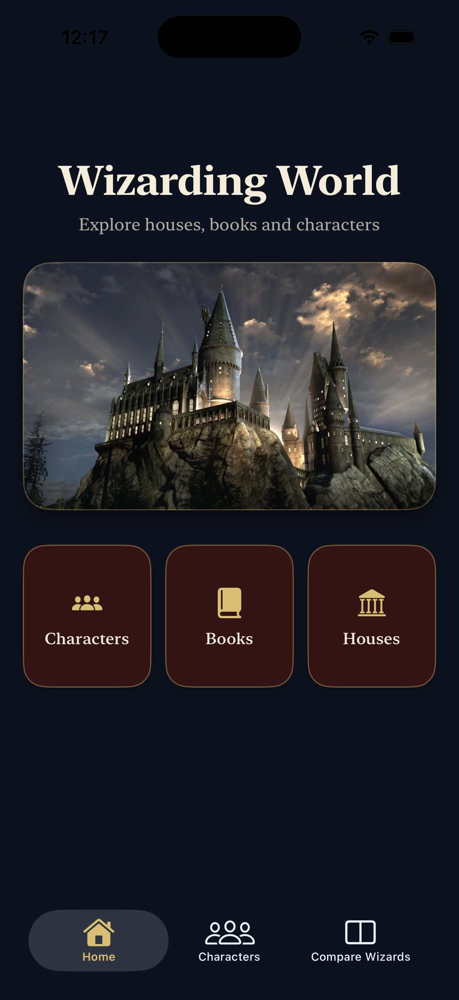
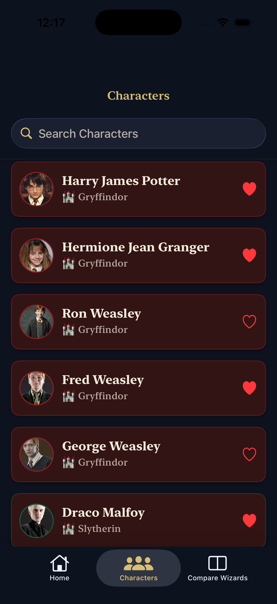
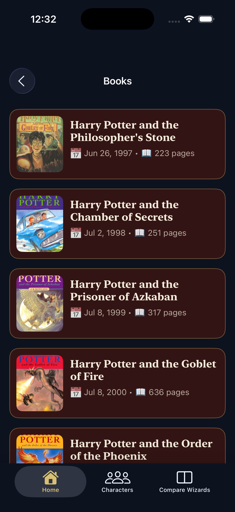
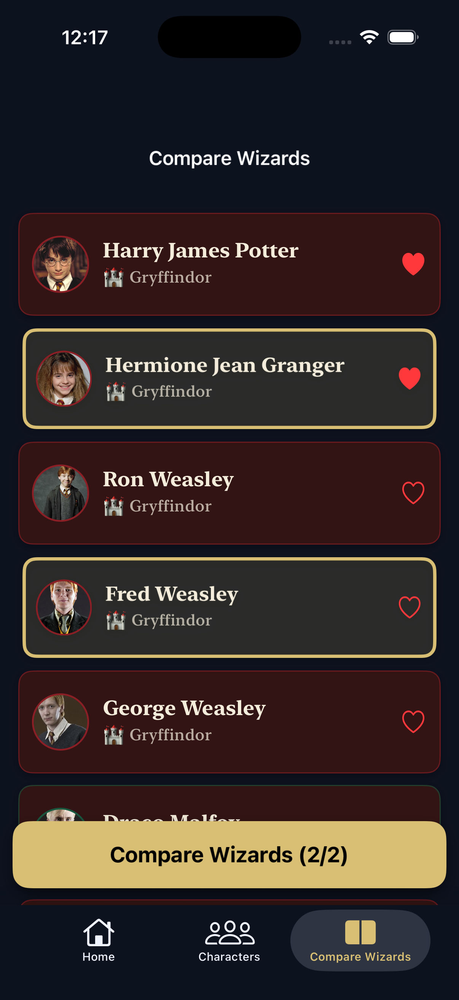
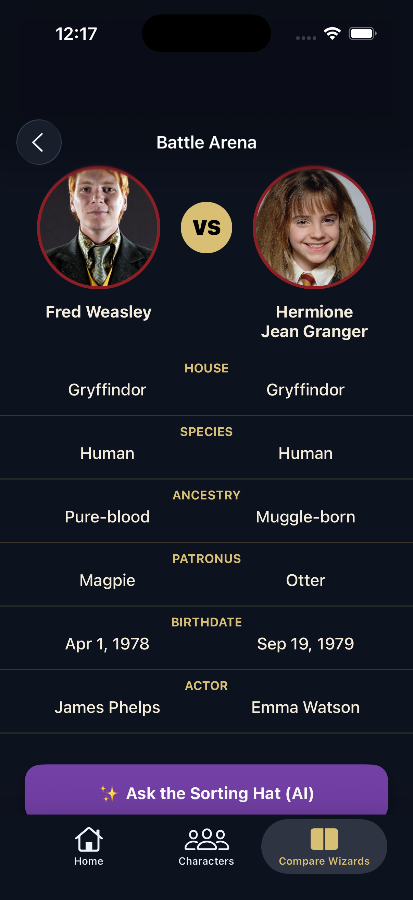
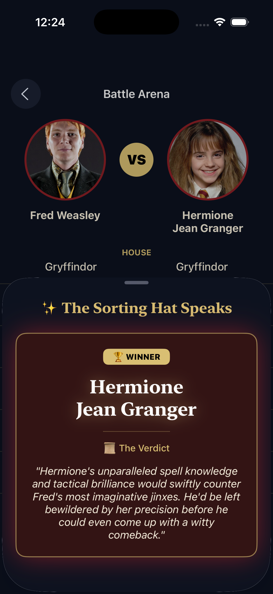

# 🧙‍♂️ Wizarding World

**Wizarding World Companion**, Harry Potter evrenini keşfetmenizi sağlayan modern bir **iOS UIKit uygulamasıdır**.  
Karakterleri, Hogwarts binalarını ve kitapları inceleyebilir; iki karakteri **yapay zekâ destekli düello karşılaştırması** ile kapıştırabilirsiniz ⚔️✨

📱 UIKit • 🧠 Gemini AI • 🎨 Özel Tema • ⚡️ Async/Await

---

## 📸 Uygulama Önizleme

### 🏠 Home Ekranı


### 🧑‍🎓 Karakterler


### 📚 Kitaplar


### ⚔️ Compare


### 🧠 AI Karşılaştırma


### 🤖 Yapay Zekâ Kararı (Gemini)


---

## ✨ Öne Çıkan Özellikler

### 🧑‍🎓 Karakterler
- Tüm Harry Potter karakterlerini listeleme
- Detaylı karakter profilleri
- Hogwarts binasına göre **dinamik renk teması**
- Favorilere ekleme / çıkarma ❤️

### 🏰 Hogwarts Binaları
- Gryffindor, Slytherin, Ravenclaw ve Hufflepuff
- Özel kart tasarımları
- Bina kimliğine uygun renk paleti

### 📚 Kitaplar
- Harry Potter kitap serisi
- Kapak görselleri
- Yayın tarihi, sayfa sayısı ve açıklama

---

## 🧠 Yapay Zekâ Destekli Karakter Karşılaştırma (⭐ STAR FEATURE)

Bu uygulamanın **en ayırt edici özelliği** 🚀

### Nasıl Çalışır?
1. Kullanıcı iki karakter seçer
2. Karakter özellikleri karşılaştırılır
3. **Google Gemini AI**, düelloyu analiz eder
4. Kazanan ve kısa gerekçe gösterilir

### ⚔️ Karşılaştırılan Özellikler
- Hogwarts Binası
- Patronus
- Soy (Ancestry)
- Tür (Species)
- Doğum Tarihi
- Oyuncu (Actor)

### 🏆 AI Çıktısı Örneği

Winner: Hermione Granger
Reason: Yüksek zekâsı, büyü bilgisi ve stratejik düşünme yeteneği
ona düelloda büyük avantaj sağlar.

> 🧙‍♂️ Bu ekran “Sorting Hat karar veriyor” temasıyla özel olarak tasarlanmıştır.

---

## ⭐ Favoriler Sistemi
- Karakterleri kalıcı olarak favoriye ekleme
- Favoriler sekmesinde otomatik güncellenen liste
- Favoriden çıkarma anında UI güncellemesi

---

## 🧱 Mimari Yapı

Projede **MVVM (Model–View–ViewModel)** mimarisi uygulanmıştır.


```bash
ViewController
↓
ViewModel
↓
NetworkService / AIService
↓
API (REST / Gemini)
```

### Katmanlar
- `NetworkService` → REST API çağrıları
- `AIService` → Google Gemini entegrasyonu
- `ViewModel` → İş mantığı & veri hazırlama
- `ViewController` → UIKit ekranları
- `Manager` → Favori & state yönetimi

---

## 🛠 Kullanılan Teknolojiler

- Swift
- UIKit
- SnapKit
- MVVM Architecture
- Async / Await
- REST API
- Google Gemini AI
- Custom UI Components
- Dark Theme Design

---

## 🚀 Kurulum ve Çalıştırma

Projeyi yerel makinenizde çalıştırmak için aşağıdaki adımları izleyin.

### 1. Repoyu Klonlayın
Terminali açın ve projeyi bilgisayarınıza indirin:

```bash
git clone https://github.com/eceakcay/HarryPotterUIKit.git
```

### 2. Projeyi Açın
HarryPotterUIKit.xcodeproj dosyasına çift tıklayarak projeyi Xcode'da açın.

### 3. API Anahtarı Yapılandırması 🔑
Bu proje Google Gemini API kullanmaktadır. Çalışması için geçerli bir API anahtarına ihtiyacınız vardır.

Google AI Studio üzerinden bir API Key edinin.

Proje içerisindeki Info.plist dosyasına gidin (veya Secrets.xcconfig dosyası oluşturun).

API anahtarınızı ilgili alana ekleyin.

⚠️ Önemli Not: API anahtarınızı içeren dosyaları asla public commit olarak göndermeyin.

### 4. Çalıştırın
Simülatör veya gerçek cihazınızı seçin ve CMD + R ile projeyi derleyin.


## 👩‍💻 Geliştirici

**Ece Akçay**  
Bilgisayar Mühendisliği Öğrencisi | iOS Developer

- 📱 UIKit • SwiftUI • AI-Driven Apps  

